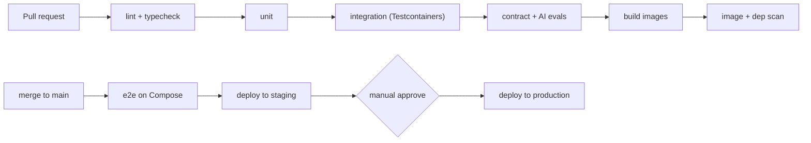

# Deployment & Infrastructure — CredResearch

Related: [System Architecture](./SYSTEM_ARCHITECTURE.md) · [Technical Specification](./TECHNICAL_SPECIFICATION.md) · [Security & Compliance](./SECURITY_AND_COMPLIANCE.md)

## 1. Environments

| Env | Purpose | Topology |
|---|---|---|
| local | Development | Docker Compose, all services |
| staging | Pre-prod verification, e2e | Single VPS (prod-like) |
| production | Live | Single VPS (MVP) → multi-node later |

## 2. Local — Docker Compose

Services:

| Service | Image / build | Role |
|---|---|---|
| `web` | Next.js (build) | Frontend (PWA) |
| `backend` | Spring Boot (build) | Core API |
| `ai-worker` | FastAPI (build) | AI/data/export |
| `postgres` | `pgvector/pgvector:pg16` | DB + vectors + FTS |
| `redis` | `redis:7` | Cache/jobs/rate-limit |
| `minio` | `minio/minio` | S3-compatible storage |
| `gotenberg` | `gotenberg/gotenberg` | DOCX/HTML → PDF |
| `mailhog` | `mailhog/mailhog` | Stub mailer (dev) |

```yaml
# infra/docker-compose.yml (abridged)
services:
  postgres:
    image: pgvector/pgvector:pg16
    environment: [POSTGRES_DB=credresearch, POSTGRES_USER=credresearch, POSTGRES_PASSWORD=devpass]
    ports: ["5432:5432"]
    volumes: ["pgdata:/var/lib/postgresql/data"]
  redis:
    image: redis:7
    ports: ["6379:6379"]
  minio:
    image: minio/minio
    command: server /data --console-address ":9001"
    environment: [MINIO_ROOT_USER=minio, MINIO_ROOT_PASSWORD=minio12345]
    ports: ["9000:9000","9001:9001"]
    volumes: ["miniodata:/data"]
  gotenberg:
    image: gotenberg/gotenberg:8
    ports: ["3001:3000"]
  mailhog:
    image: mailhog/mailhog
    ports: ["8025:8025","1025:1025"]
  ai-worker:
    build: ../services/ai-worker
    env_file: ../.env
    depends_on: [postgres, redis, minio, gotenberg]
  backend:
    build: ../services/backend
    env_file: ../.env
    depends_on: [postgres, redis, minio, ai-worker]
    ports: ["8080:8080"]
  web:
    build: ../apps/web
    env_file: ../.env
    depends_on: [backend]
    ports: ["3000:3000"]
volumes: { pgdata: {}, miniodata: {} }
```

## 3. Environment variables

| Var | Used by | Notes |
|---|---|---|
| `DATABASE_URL` | backend, worker | Postgres DSN |
| `REDIS_URL` | backend, worker | |
| `JWT_PRIVATE_KEY` / `JWT_PUBLIC_KEY` | backend | RS256 access tokens |
| `INTERNAL_SERVICE_SECRET` | backend, worker | signs/verifies internal JWT |
| `STORAGE_ENDPOINT` / `STORAGE_BUCKET` / `STORAGE_ACCESS_KEY` / `STORAGE_SECRET_KEY` / `STORAGE_REGION` | backend, worker | S3/MinIO/R2 |
| `LLM_PROVIDER` / `LLM_API_KEY` / `LLM_MODEL_CHEAP` / `LLM_MODEL_STRONG` | worker | gateway routing |
| `EMBEDDING_MODEL` / `EMBEDDING_DIM` | worker | keep dim consistent with schema |
| `GOTENBERG_URL` | worker | PDF conversion |
| `PAYSTACK_SECRET` / `PAYSTACK_WEBHOOK_SECRET` | backend | |
| `FLUTTERWAVE_SECRET` / `FLUTTERWAVE_WEBHOOK_HASH` | backend | |
| `EMAIL_*` (SMTP/SES/Resend) | backend | transactional email |
| `SMS_PROVIDER` / `TERMII_API_KEY` | backend | SMS |
| `WHATSAPP_*` | backend | optional |
| `SENTRY_DSN` (web/backend/worker) | all | error monitoring |
| `APP_BASE_URL` / `API_BASE_URL` | all | links, magic-links |

Local uses `.env` (never committed). Staging/prod inject via the platform; migrate to SOPS/Doppler/Vault as the team grows.

## 4. Production — VPS deployment (MVP)

- Single well-sized VPS running `docker-compose.prod.yml` (web, backend, ai-worker, redis, gotenberg). **PostgreSQL** either on the VPS (with rigorous backups) or a managed instance; **object storage** off-box (R2/Spaces/S3).
- **Nginx** terminates TLS and reverse-proxies:
  - `/` → web
  - `/api` → backend
  - public review/survey paths → backend
  - worker is **not** internet-exposed.
- **Let's Encrypt** via certbot (auto-renew).

```nginx
# infra/nginx/credresearch.conf (abridged)
server {
  listen 443 ssl;
  server_name app.credresearch.africa;
  ssl_certificate     /etc/letsencrypt/live/app.credresearch.africa/fullchain.pem;
  ssl_certificate_key /etc/letsencrypt/live/app.credresearch.africa/privkey.pem;
  add_header Strict-Transport-Security "max-age=31536000" always;

  location /api/ { proxy_pass http://backend:8080; proxy_set_header X-Request-Id $request_id; }
  location /     { proxy_pass http://web:3000; }
  client_max_body_size 50m;   # uploads go to storage via signed URL, but cap proxy
}
```

## 5. CI/CD — GitHub Actions



- Images pushed to a registry (GHCR); prod pulls pinned tags.
- Deploy = pull images + `docker compose up -d` over SSH (or a lightweight deployer); zero-downtime via health-gated restarts.
- Flyway migrations run on backend startup and are a CI gate.

## 6. Migration strategy (Flyway)

- All schema changes are versioned `V__` migrations; forward-only; applied automatically on backend boot.
- CI applies migrations against a fresh Postgres+pgvector container on every PR.
- Expand→migrate→contract for destructive changes to keep deploys safe.
- Seed migrations: roles/permissions, global templates, plans, demo institution.

## 7. Backup strategy

- **Postgres:** nightly base backup + continuous WAL archiving to off-box storage (pgBackRest/WAL-G). RPO ≤ 15 min.
- **Object storage:** versioning + lifecycle rules; cross-region copy in prod.
- **Restore drills:** scheduled test restores into staging; runbook documents RTO ≤ 2 h.
- Backup integrity checked (checksums); retention per policy.

## 8. Monitoring strategy

- **MVP:** Sentry (web/backend/worker), Actuator health/readiness, external uptime monitor with alerting, structured logs with request IDs, AI cost/usage dashboard from `ai_usage_logs`.
- **Post-MVP:** OpenTelemetry traces, Prometheus + Grafana dashboards, Loki log aggregation.
- Alerts route to on-call; key SLOs: API p95, AI job success rate, queue depth, error rate, disk/DB health.

## 9. Scaling path

1. Split AI worker onto its own box; introduce **RabbitMQ** when Redis-coordinated jobs strain under depth.
2. Add Postgres **read replica(s)** for read-heavy dashboards.
3. Move FTS to **OpenSearch/Meilisearch** only if Postgres FTS hits limits.
4. Introduce a **load balancer + multiple stateless backend/web instances**.
5. Adopt **Kubernetes** only once operational maturity justifies it. See [ADR-012](./ENGINEERING_DECISIONS.md).

## 10. Runbooks (to maintain)

- Restore-from-backup; rotate secrets; certificate renewal failure; worker/LLM outage (degrade gracefully); webhook replay/reconciliation; tenant data export/deletion (DSAR).
