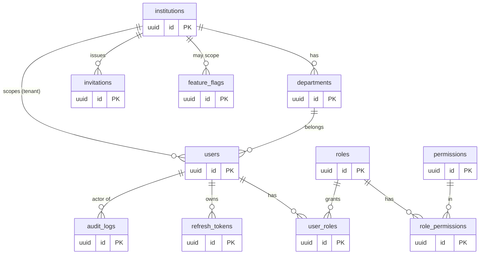
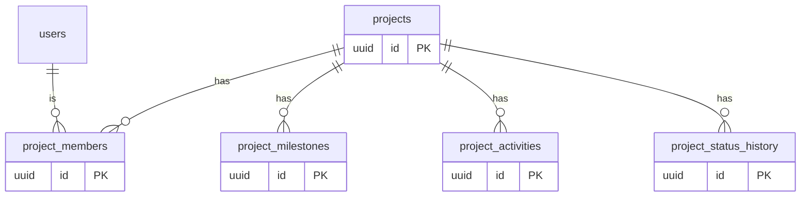
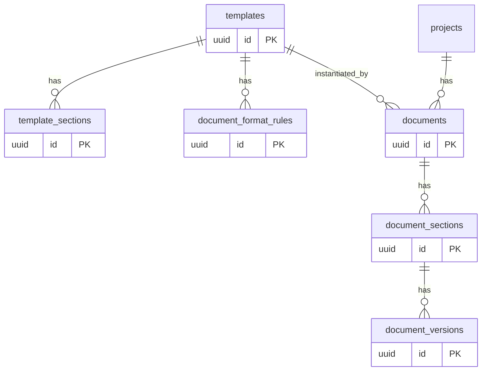
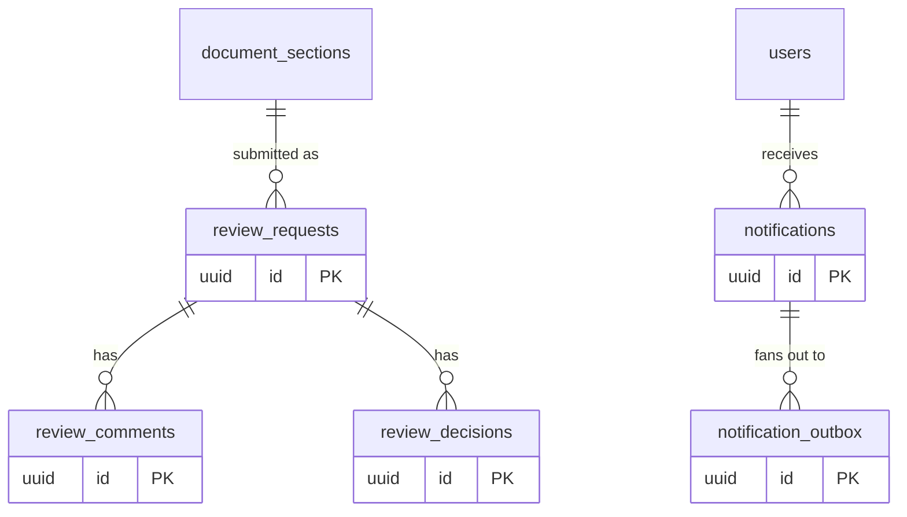
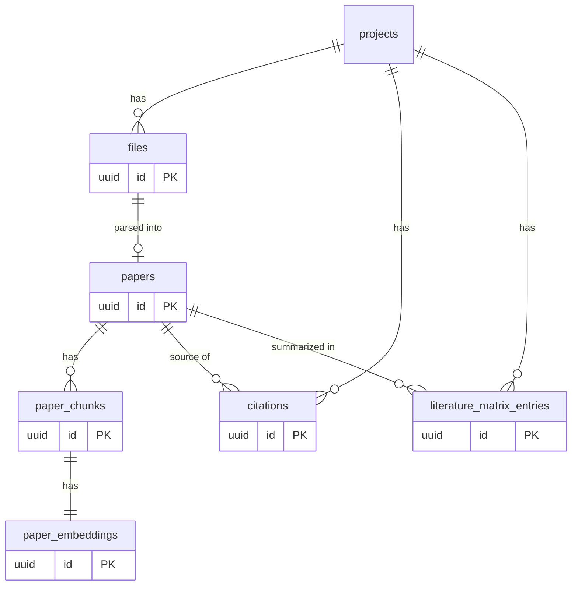
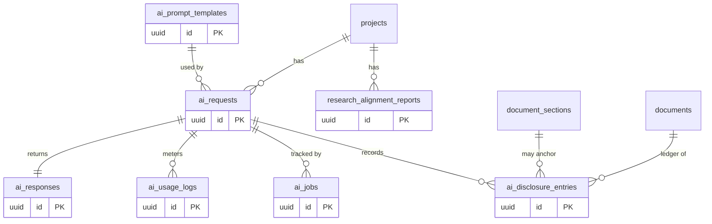
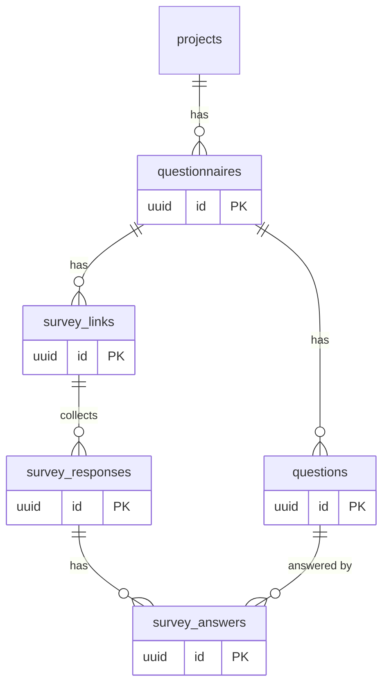
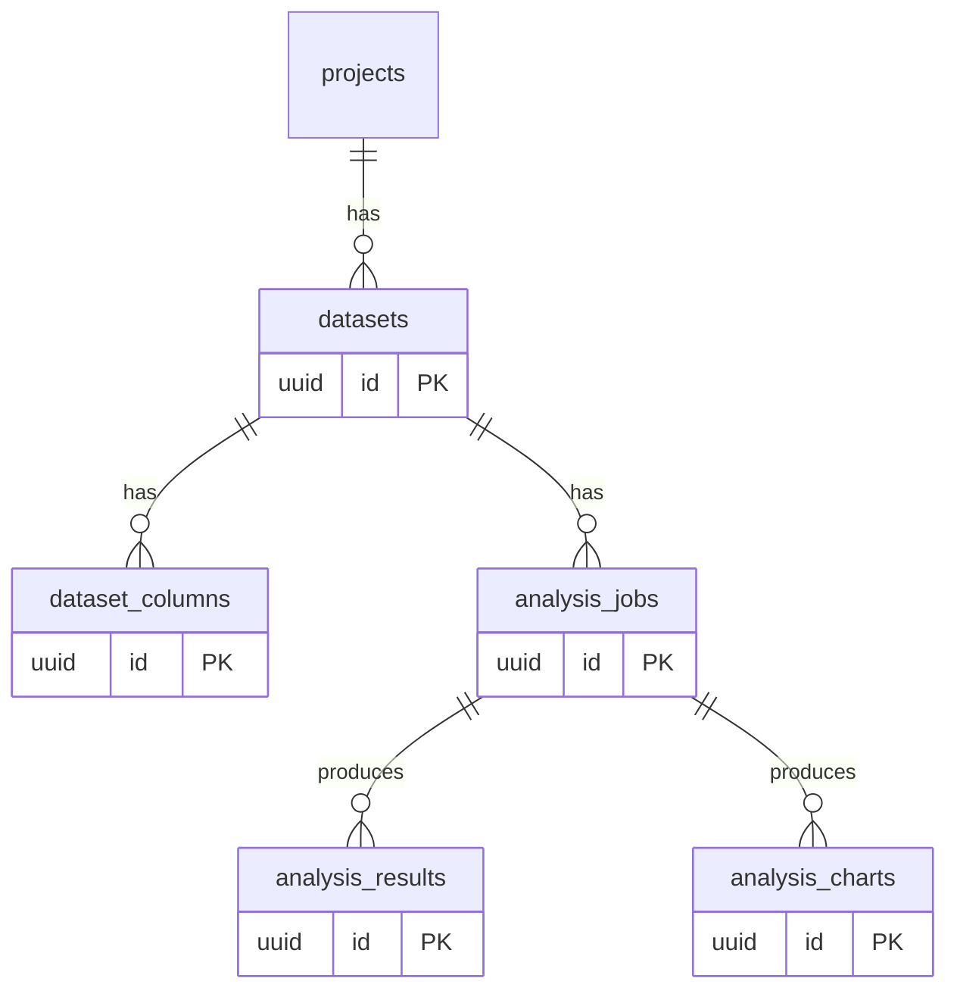
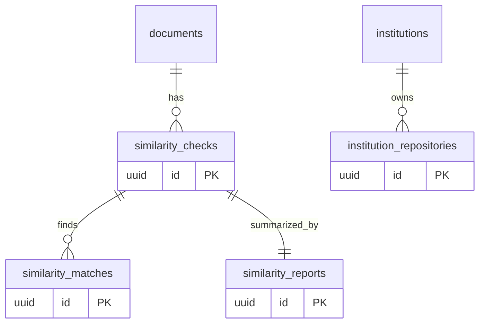
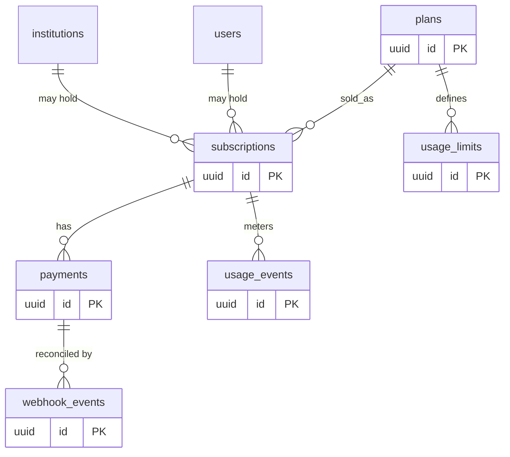

# ERD — CredResearch

Related: [Database Schema](./DATABASE_SCHEMA.md) · [Functional Requirements](./FUNCTIONAL_REQUIREMENTS.md)

## Conventions

- PKs are UUID v7 (`id`).
- Every table carries `created_at`, `updated_at`; mutable user-data tables carry `created_by`, `updated_by`, and soft-delete `deleted_at`.
- Tenant-scoped tables carry `institution_id` (FK; nullable only for personal-tenant rows resolved via a synthetic institution).
- FK suffix `_id`. Join tables named `<a>_<b>`.

## Mermaid ERD

> Split into domain sub-diagrams for readability; relationships across domains are noted in text and in [Database Schema](./DATABASE_SCHEMA.md).

### Identity & organization

### Projects

### Templates & documents

### Reviews & notifications

### Papers, literature & citations

### AI & disclosure

### Questionnaires & survey

### Data analysis

### Similarity

### Billing

## Entity explanations

### Identity & organization
- **institutions** — top-level tenant. Name, country, type, logo, status. Independent users map to a synthetic personal institution.
- **departments** — academic unit within an institution; owns template customizations and student rosters.
- **users** — account. Belongs to an institution (tenant) and optionally a department; holds an academic profile.
- **roles / permissions / user_roles / role_permissions** — RBAC. A user has many roles; roles have many permissions. Multi-role supported.
- **refresh_tokens** — hashed, rotating refresh tokens; revocable; track device/UA, expiry.
- **audit_logs** — append-only record of security/admin-significant actions (actor, action, target, before/after, ip).
- **invitations** — pending invites for supervisors/admins/students, including **magic-link** tokens for account-less supervisor review. Resolves to a user on acceptance.
- **feature_flags** — staged rollout toggles, optionally scoped to an institution/plan.

### Projects
- **projects** — a research effort. Title, level (UG/MSc/PhD), department, status, owner.
- **project_members** — membership with project-role (owner/student, supervisor, consultant, viewer); supports co-supervisors.
- **project_milestones** — title, due date, status; drives reminders.
- **project_activities** — activity feed events.
- **project_status_history** — immutable status-transition log.

### Templates & documents
- **templates** — UG/MSc/PhD blueprints; clonable per institution/department.
- **template_sections** — ordered section definitions (heading, order, guidance, chapter).
- **document_format_rules** — font, spacing, numbering, margins, citation style — applied at export.
- **documents** — a project's document instantiated from a template.
- **document_sections** — ordered sections; `content` is ProseMirror JSON (`jsonb`); `version` for optimistic locking.
- **document_versions** — immutable snapshots for history/restore.

### Reviews & notifications
- **review_requests** — a submitted section/document awaiting a supervisor; status open/closed.
- **review_comments** — inline comments anchored to text ranges; resolvable threads.
- **review_decisions** — APPROVED / NEEDS_REVISION / REJECTED + note; history preserved across resubmissions.
- **notifications** — per-user in-app notifications.
- **notification_outbox** — per-channel delivery rows (email/SMS/WhatsApp) with status, for reliable fan-out and retries.

### Papers, literature & citations
- **files** — any uploaded binary (object-storage key, checksum, type, owner, tenant).
- **papers** — a parsed academic file with extracted metadata + summary fields (method/findings/limitations/gaps).
- **paper_chunks** — text chunks for RAG.
- **paper_embeddings** — pgvector embedding per chunk (1:1).
- **citations** — bibliographic records (sourced from a paper or manual/BibTeX/RIS import); rendered via CSL.
- **literature_matrix_entries** — per-project synthesized matrix rows linking papers to objectives/method/findings/gap.

### AI & disclosure
- **ai_requests** — a logged AI invocation (type, input ref, prompt template, model, user).
- **ai_responses** — the structured JSON result.
- **ai_prompt_templates** — versioned prompt definitions for each AI feature.
- **ai_usage_logs** — token counts, cost, latency, model — for metering and AI-cost dashboards.
- **ai_jobs** — generic async job tracking (status, attempts, payload_ref, result_ref, error).
- **research_alignment_reports** — persisted alignment reports (score + findings JSON).
- **ai_disclosure_entries** — the **Integrity Ledger**: append-only, hash-chained per-document record of each AI interaction and the user's accept/edit/reject action.

### Questionnaires & survey (MVP+)
- **questionnaires / questions** — instrument + items (type, options, required).
- **survey_links** — tokenized public links.
- **survey_responses / survey_answers** — collected responses + per-question answers; respondent consent captured.

### Data analysis (MVP+)
- **datasets / dataset_columns** — uploaded CSV + inferred column metadata.
- **analysis_jobs / analysis_results / analysis_charts** — descriptive-stats jobs and their outputs.

### Similarity (MVP+)
- **similarity_checks / similarity_matches / similarity_reports** — internal pre-check runs, matched spans, and the summary report.
- **institution_repositories** — opt-in corpus an institution contributes for internal comparison.

### Billing
- **plans** — Free, Student Basic/Pro, Consultant, Department, Institution + pricing (multi-currency).
- **subscriptions** — a plan held by a user or an institution; lifecycle states.
- **payments** — transactions (Paystack/Flutterwave/manual); minor-unit amounts + currency.
- **usage_limits** — per-plan caps (projects, AI credits, uploads, exports, similarity checks, invitations).
- **usage_events** — metered consumption events (also mirrored in Redis counters for fast enforcement).
- **webhook_events** — provider event log keyed by provider event id for idempotent reconciliation.

## Cross-domain relationships (summary)
- Institution → departments → users; users ↔ roles ↔ permissions (via join tables).
- Users ↔ projects via project_members; projects own documents, papers, citations, questionnaires, datasets, ai_requests, alignment reports.
- Templates → template_sections; documents → sections → versions + review_requests; review_requests → comments + decisions.
- Papers → chunks → embeddings; projects → literature_matrix_entries.
- Questionnaires → questions + responses; responses → answers.
- Datasets → analysis_jobs → results + charts.
- Subscriptions → users or institutions; payments → subscriptions; webhook_events → payments.
- ai_disclosure_entries → documents (and optionally sections + ai_requests).
