# MVP Roadmap — CredResearch

Related: [PRD](./PRD.md) · [Functional Requirements](./FUNCTIONAL_REQUIREMENTS.md) · [System Architecture](./SYSTEM_ARCHITECTURE.md)

## MVP boundary (read this first)

- **Minimum good-enough MVP = Phases 0–6 + the AI-Use Disclosure Ledger (Module 13) + the export/payment/admin slices of Phase 10.**
- **MVP-plus (only if capacity allows): Phases 7–9.**
- Everything in "Deferred" stays out until after MVP.

```mermaid
gantt
    title Build sequence (indicative)
    dateFormat  X
    axisFormat %s
    section Foundation
    Phase 0 Foundation            :0, 1
    section Core MVP
    Phase 1 Auth/Tenancy          :1, 2
    Phase 2 Project Workspace     :2, 1
    Phase 3 Doc Builder           :3, 2
    Phase 4 AI Assistant          :5, 2
    Phase 5 Papers/Citations      :7, 2
    Phase 6 Supervisor Review     :9, 2
    Disclosure Ledger             :9, 1
    Export/Billing/Admin (P10)    :11, 2
    section MVP-plus
    Phase 7 Questionnaire         :13, 1
    Phase 8 Data Analysis         :14, 1
    Phase 9 Similarity            :15, 1
```

---

## Phase 0 — Product & Engineering Foundation
**Deliver:** PRD, functional + non-functional requirements, technical architecture, ERD, **`openapi.yaml` API contract**, design system, repo structure, **Docker Compose**, env-var plan, **LLM gateway + notification provider abstractions (stubbed)**, **Sentry + Actuator wired**, **test harness (Testcontainers, Playwright) + AI eval scaffold**, secrets/env strategy, CI skeleton.
**Exit:** a developer can `docker compose up` and hit a healthcheck across all services; CI runs lint/test/build.

## Phase 1 — Authentication, Roles & Multi-Tenant Base
**Deliver:** register/login, email verification, JWT access + rotating refresh tokens, RBAC (roles/permissions), institutions, departments, user profile, tenant isolation (+ isolation test suite), institution onboarding + bulk student import, demo institution seed.
**Exit:** users authenticate, hold roles, and are strictly tenant-scoped; isolation suite green.

## Phase 2 — Project Workspace & Milestone Engine
**Deliver:** project creation, project dashboard, milestones (+ reminders), project members (co-supervisors), activity feed, status tracking + history.
**Exit:** a student can create and manage a project end-to-end (minus documents).

## Phase 3 — Template & Document Builder
**Deliver:** template selection (UG/MSc/PhD), document sections, Tiptap editor (ProseMirror JSON), autosave with optimistic locking + offline buffering, version history/restore, format rules.
**Exit:** a student can author proposal + Ch1–3 sections reliably on a flaky connection.

## Phase 4 — AI Research Assistant
**Deliver:** topic generator + feasibility, proposal assistant, methodology assistant, objective/RQ/hypothesis generator, problem-statement refinement, **Research Alignment Engine**, AI usage tracking + per-plan credits, **disclosure ledger writes**.
**Exit:** AI features return validated JSON, respect guardrails, decrement credits, and log to the ledger; alignment report renders.

## Phase 5 — Paper Upload, Literature Review & Citations
**Deliver:** upload papers (signed URLs), extract text + metadata (OCR fallback, quality flag), summarize papers, generate literature matrix, manage citations, **BibTeX/RIS import/export**, reference list via CSL (APA/IEEE/Harvard), chunk + embed (pgvector) + RAG.
**Exit:** a project's literature → matrix → citations → reference list works end-to-end with RAG grounded in uploads.

## Phase 6 — Supervisor Review & Collaboration
**Deliver:** invite supervisor, **magic-link review** for account-less supervisors, submit section for review, inline comments, review decisions, revision history, supervisor inbox/dashboard, notifications.
**Exit:** a full submit → review → decision → revise cycle works, including for an external supervisor with no account.

> ✅ **At the end of Phase 6 + Disclosure Ledger + the Phase 10 export/payment/admin slice, the MVP is shippable.**

## Phase 7 — Questionnaire Builder & Data Collection *(MVP+)*
**Deliver:** questionnaire generation from objectives, survey forms, public tokenized links, response collection (consent), CSV export.

## Phase 8 — Basic Data Analysis & Chapter 4 Starter *(MVP+)*
**Deliver:** CSV upload, descriptive statistics, charts, data-cleaning hints, AI interpretation (grounded), Chapter 4 starter.

## Phase 9 — Basic Similarity & Originality Pre-check *(MVP+)*
**Deliver:** internal similarity check, citation-risk detection, repeated-paragraph detection, similarity report (explicitly not Turnitin).

## Phase 10 — Export, Billing & Production Hardening
**MVP slice (ship with core):** DOCX export, PDF export, ZIP package export (incl. disclosure statement), Paystack/Flutterwave billing + multi-currency, subscription limits + Redis metering, admin dashboard, logging, error monitoring (Sentry), rate limiting, backups + restore drill.
**Post-ship hardening:** OpenTelemetry, Prometheus/Grafana, Loki, queue migration to RabbitMQ as load grows.

---

## Deferred (post-MVP)
Kubernetes, native mobile apps, full offline mode, ERP/SIS integrations, full SPSS/Turnitin replacement, real-time collaborative editing (Yjs), OpenSearch/Meilisearch, Zotero/Mendeley import (unless trivially early).

## Sequencing notes
- Phase 0 establishes the contract and harness so all later phases integrate cleanly — do not skip it.
- The **Disclosure Ledger** rides alongside Phase 4 (first AI writes) and is finalized before first export — it is part of the MVP, not a stretch.
- **Magic-link review** (Phase 6) and **BibTeX/RIS import** (Phase 5) are small but high-leverage adoption features — keep them in MVP.
- Phases 7–9 are independent of each other and can be picked up in any order based on demand.
