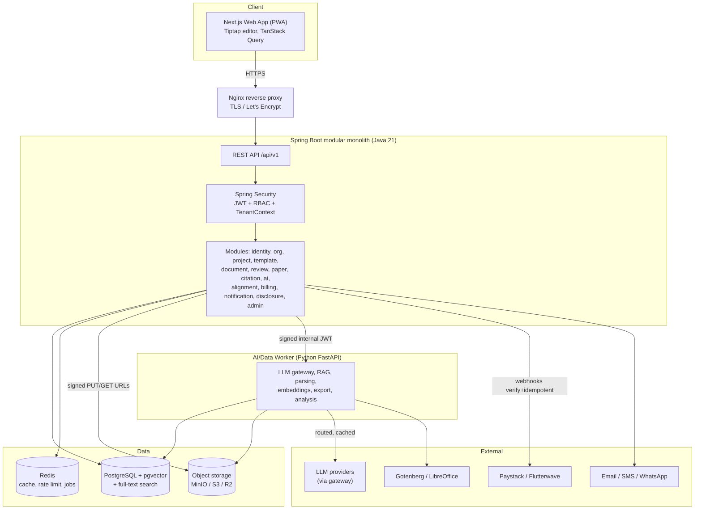
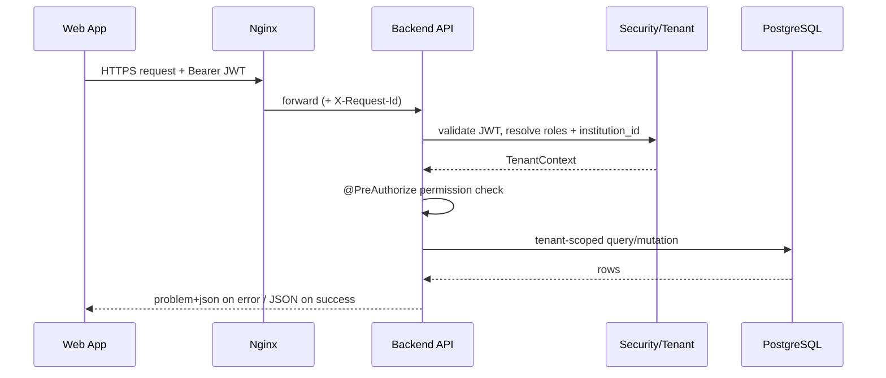
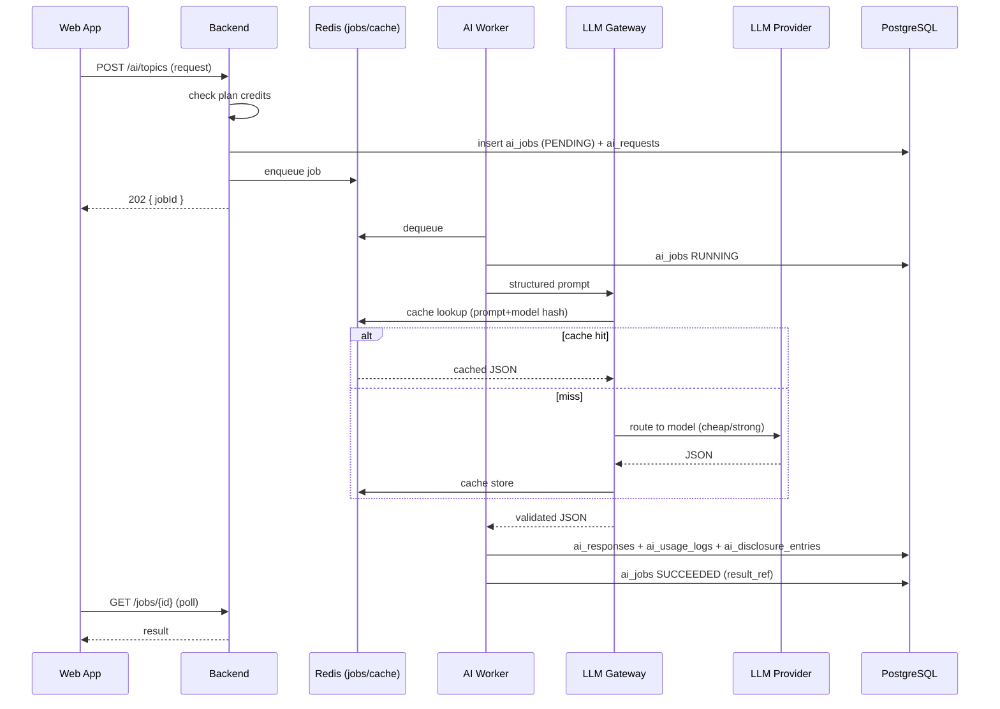
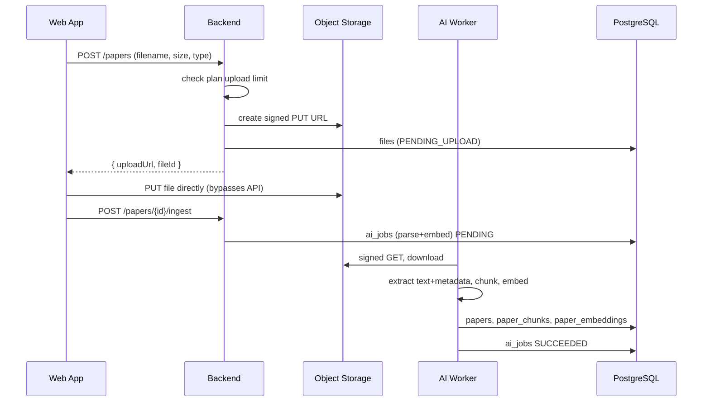
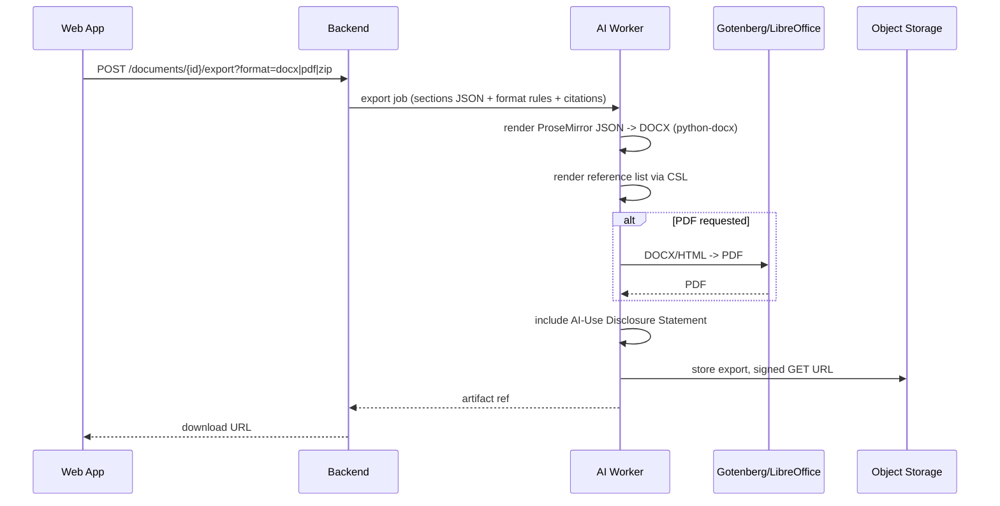
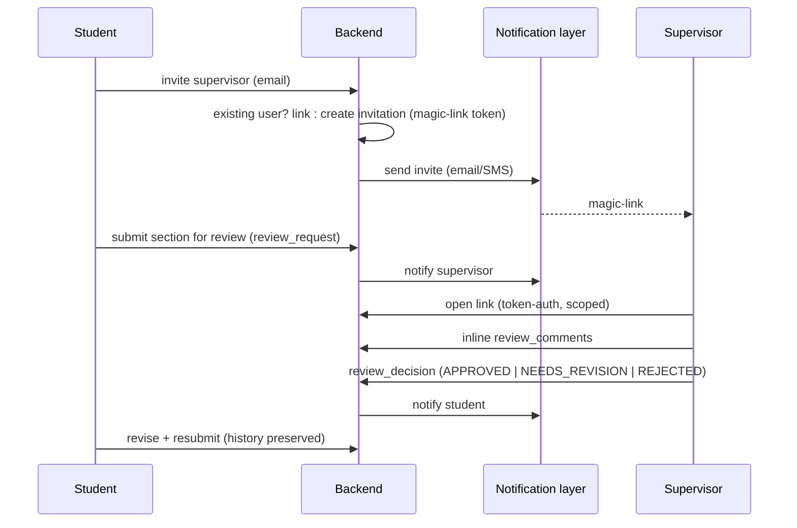
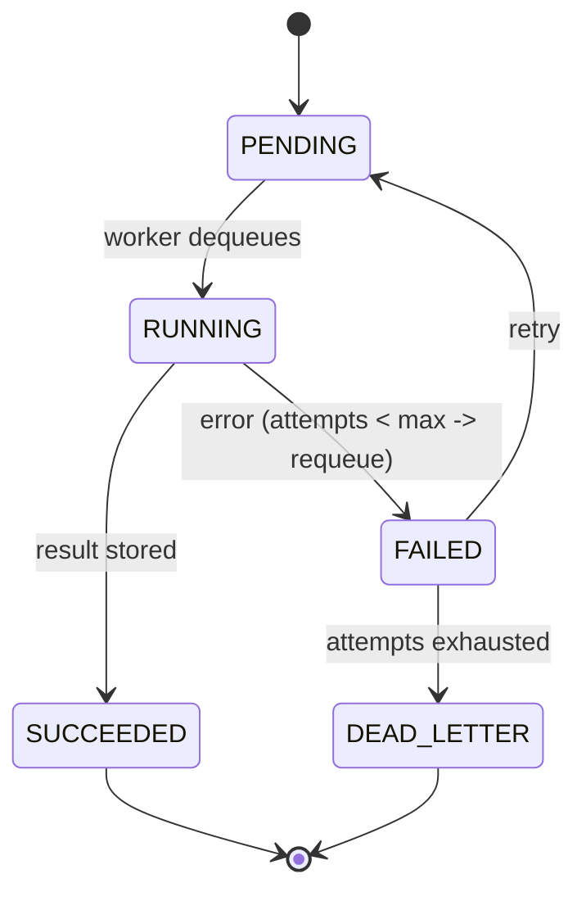
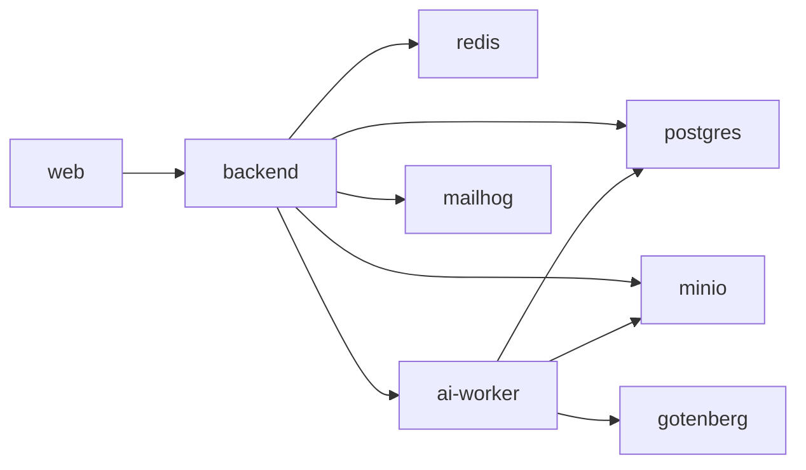
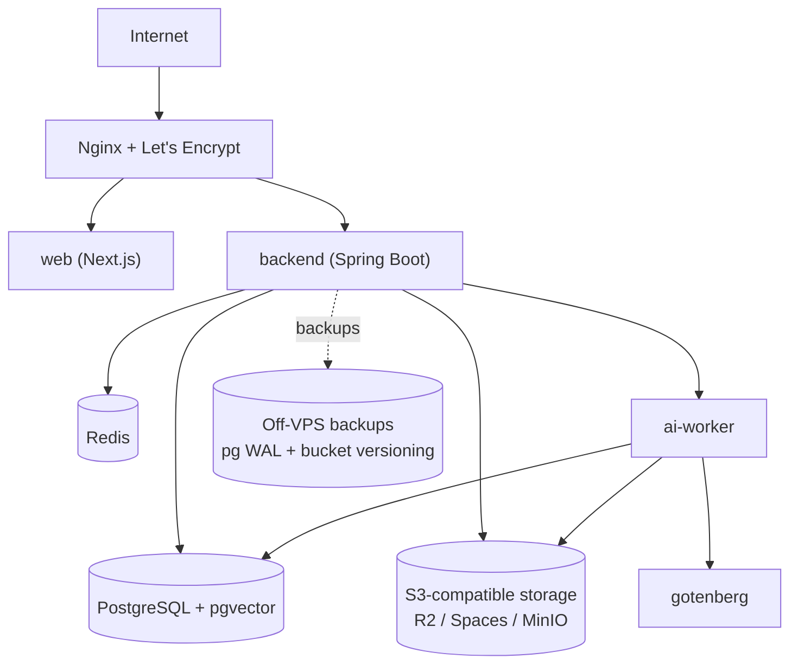
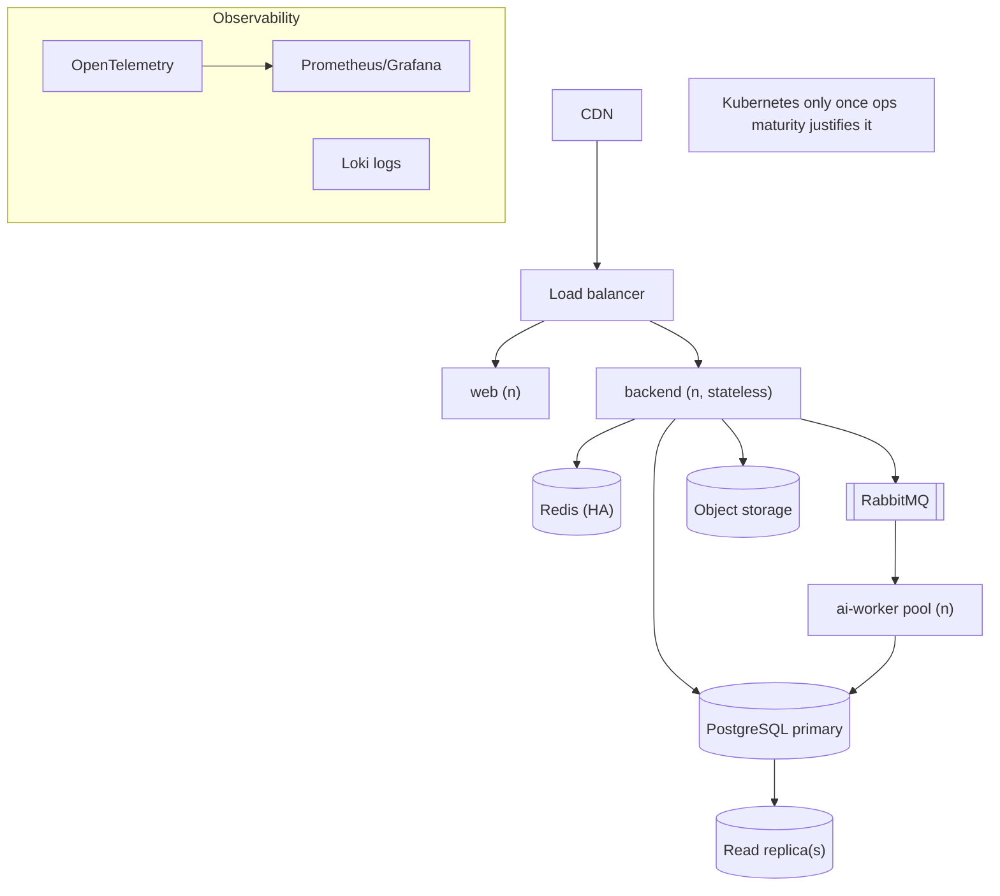

# System Architecture — CredResearch

Related: [Technical Specification](./TECHNICAL_SPECIFICATION.md) · [AI System Design](./AI_SYSTEM_DESIGN.md) · [Deployment](./DEPLOYMENT_AND_INFRASTRUCTURE.md)

## 1. High-level system diagram

## 2. Request lifecycle (synchronous read/write)

## 3. AI task lifecycle (async, gateway + cache)

## 4. File upload lifecycle

## 5. Document export lifecycle

## 6. Supervisor review lifecycle (incl. magic-link)

## 7. Background job lifecycle

## 8. Local development architecture

Docker Compose services: `web`, `backend`, `ai-worker`, `postgres` (pgvector image), `redis`, `minio`, `gotenberg`, `mailhog` (stub mailer). Nginx optional locally; services talk over the compose network. See [Deployment](./DEPLOYMENT_AND_INFRASTRUCTURE.md).

## 9. Early production deployment (single VPS)

All containers on one VPS via `docker-compose.prod.yml`; object storage and backups off-box; Sentry external.

## 10. Later-scale architecture (post-MVP)

Triggers to evolve: sustained AI queue depth (→ RabbitMQ + worker pool), read pressure (→ read replicas), FTS limits (→ OpenSearch/Meilisearch), and team size/ops maturity (→ Kubernetes).
